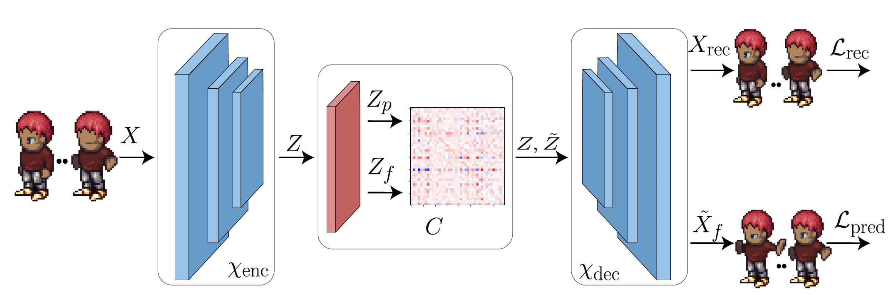

# Multifactor Sequential Disentanglement via Structured Koopman Autoencoders (SKD)

## Overview
We propose a simple and easy to code new deep model that is fully unsupervised and it supports multifactor disentanglement. We showcase new disentangling abilities such as swapping of individual static factors between characters, and an incremental swap of disentangled factors from the source to the target.

<div align=center></div>

The architercture of our method is demonstrated in the figure above. Further, to promote disentanglement, we introduce a novel eigen loss.

## Training

We provide the training file for the sprites dataset that enables training from scratch. The sprites dataset can be found on a third-party [repo](https://github.com/YingzhenLi/Sprites).
To run the training process:
```
python train.py
```

## Experiments

In the experiments directory, you can find the code for the two factor swapping and the multifactor swapping experiments for the sprites dataset, reproducing results from the paper.
Simply run:
```
python ./experiments/disentanglement_swaps.py
```


## Paper
```bibtex
@inproceedings{
berman2023multifactor,
title={Multifactor Sequential Disentanglement via Structured Koopman Autoencoders},
author={Nimrod Berman and Ilan Naiman and Omri Azencot},
booktitle={The Eleventh International Conference on Learning Representations },
year={2023},
url={https://openreview.net/forum?id=6fuPIe9tbnC}
}
```
